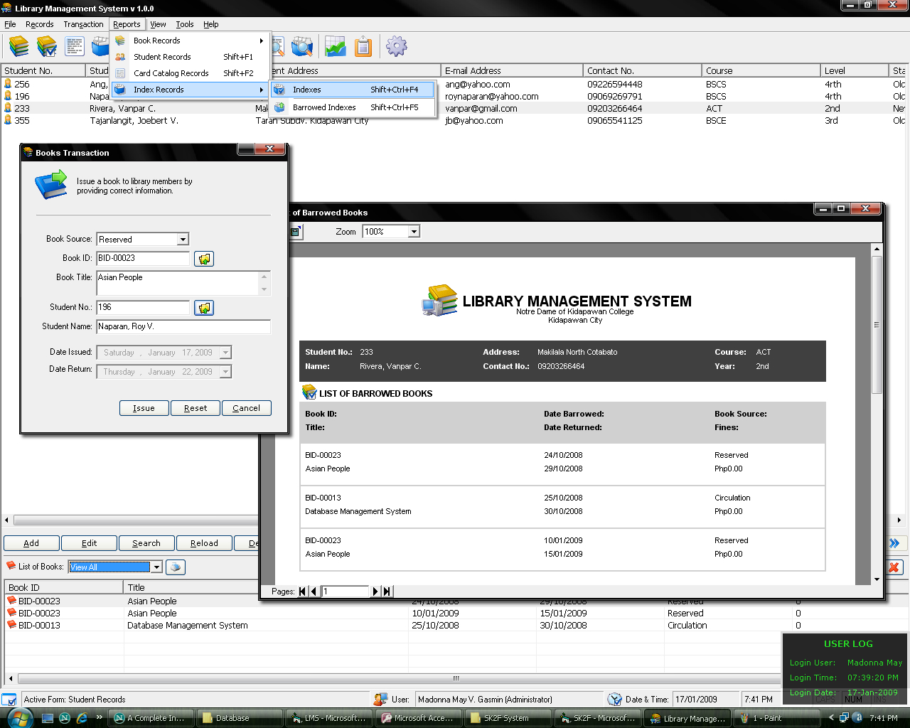



## Library Management System \(Updated\)

### Description

This Library Management System is for the beginners in VB 6 like me. It has a card catalog system, indexing, book inventory and profiling. It shows how to connect with your database. It generates reports, receipts and book inventory. Please vote this program. GOD BLESS YOU ALL..You can download missing files here http://www.mediafire.com/?gjlmbqy3xmc
 
### More Info
 

             |
---                |---
**Submitted On**   |2009-01-17 20:03:30
**By**             |[Roy Naparan](https://github.com/Planet-Source-Code/PSCIndex/blob/master/ByAuthor/roy-naparan.md)
**Level**          |Beginner
**User Rating**    |4.6 (124 globes from 27 users)
**Compatibility**  |VB 5\.0, VB 6\.0, VBA MS Access, VBA MS Excel
**Category**       |[Complete Applications](https://github.com/Planet-Source-Code/PSCIndex/blob/master/ByCategory/complete-applications__1-27.md)
**World**          |[Visual Basic](https://github.com/Planet-Source-Code/PSCIndex/blob/master/ByWorld/visual-basic.md)
**Archive File**   |[Library\_Ma2140691172009\.zip](https://github.com/Planet-Source-Code/roy-naparan-library-management-system-updated__1-71648/archive/master.zip)

